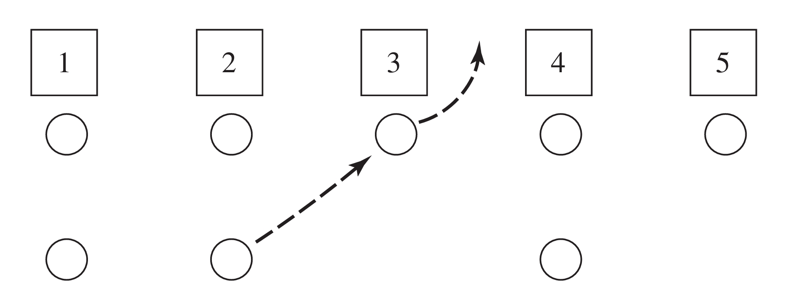

# Bank Simulation — Problem Statement

## Overview 🔧

A bank with five tellers opens at **9:00 a.m.** and closes at **5:00 p.m.**. Customers arrive while the bank is open and the bank continues to operate after 5:00 p.m. until all customers who arrived by 5:00 p.m. have been served.

- Interarrival times are IID exponential with mean **1.0 minute** (i.e., arrival rate λ = 1/min).
- Service times are IID exponential with mean **4.5 minutes** (i.e., service rate μ = 1/4.5 per teller per minute).
- Each teller has a separate queue (a customer in service counts as being in front of that teller).

## Queueing and Jockeying Rules 🧭

- On arrival, a customer joins the **shortest** queue. In case of ties, the customer chooses the **leftmost** shortest queue.

- Jockeying rule (see Figure 1): After a service completion at teller i, if there exists any other teller j whose queue length is larger than teller i's queue length (i.e., nj ≥ ni + 1), then a customer from the **tail** of the longest such queue j will **jockey** to the tail of queue i to balance load. If multiple candidate queues exist, the jockeying customer is chosen from the closest, leftmost such queue. If teller i is idle when a jockey arrives, that jockey immediately begins service at teller i.

> The initial condition for every simulated day is that the bank opens empty (no customers present at 9:00 a.m.).

---

_Figure 1 — An example of jockeying after a service completion._

---

## Experiment and Metrics 📊

Management is considering changing the number of tellers. For each of the cases **n = 4, 5, 6, and 7** tellers estimate the following performance measures:

1. **Expected time-average total number of customers in queue** (time-average over a single simulated bank day, then averaged across replications).
2. **Expected average delay in queue** (sample mean delay per customer; average the per-day sample means across replications or pool across customers as desired — report exactly which method was used).
3. **Expected maximum delay in queue** observed during a day (compute the maximum delay in queue among all customers that day, then average this maximum across replications).
